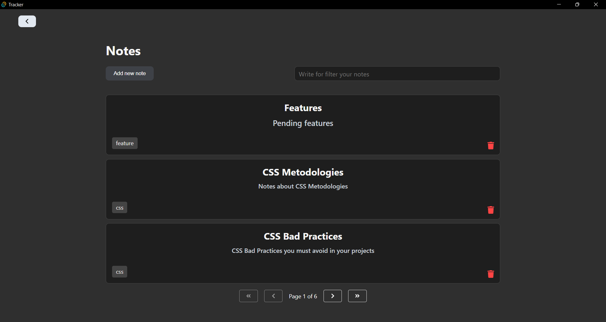

# Tauri Frontend Application

This directory contains the main files of Tracker application. The idea of this app is go deeper in the learning of the Rust programming language and at the same time create a useful tool for day to day tasks. Why Tracker? Because is for you to track your own stuffs. Any stuff...

 *Notes page*

## Some ideas for the app:
- Allow to take notes and filter the notes by date, by categories
- Have calendars for track habits, or any other idea. 
- Maybe an interface for run an AI model with your own personal data locally.
- Maybe a tool for organize your digital books and query them, with a pdf-viewer in it.

**Notes**: 
- If you want to contribute see contribution guide at the end of the file 👇
- Propose any idea for the app, it could be interesting implement it.
- Implement variety of Rust code and try new things on the project, this project is also a tool for learning.

## 📦 Prerequisites
- Node.js (v18+)
- Rust (v1.70+)

## 🛠 Tech Stack
- **Rust** (v1.85.1)
- **Tauri** (v1) - App bundler/system integration
- **Diesel ORM** (v2.2.0) - PostgreSQL/SQLite database interaction
- **React.js** (v18.3.1) - Framework for build the client side of the app
- **Typescript** (v5.6.2) - Language of the client side of the app

## 🛠 Development
```bash
  yarn
  yarn tauri dev   # Start dev server (frontend + Rust backend) - it install the backend dependencies
```

## 🏗 Production Build
```bash
  yarn tauri build  # Creates platform-specific packages
```

## 🗂 Project Structure
```
    frontend/
    ├── src/
    │   ├── App.tsx           # App entry
    │   ├── hooks/            # Custom hooks
    │   └── components/       # UI components
    │       ├──PostForm.tsx   # Form for create posts, tasks, etc
    │       ├──PostItem.tsx   # Item of the list of posts
    │       ├──PostList.tsx   # List of posts
    │       └──Tag.tsx        # Tag element of the Item
    src-tauri/                # Rust backend (see its README)
```


## 🤝 Contributing
1. Fork the repository
2. Create feature branch (`git checkout -b feat/awesome-feature`)
3. Commit changes (`git commit -m 'Add awesome feature'`)
4. Push to branch (`git push origin feat/awesome-feature`)
5. Open Pull Request

## 📜 License
MIT © José Daniel García Suero
